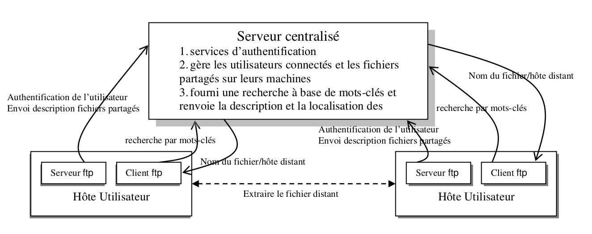

# P2P-python2

## Demo

1. Lancement du serveur centralisé. `server.py`
2. Création de **user1** et de **user2** (avec passwords: user1 user2 ) en spécifiant **user1** sur `listen`. 
3. Afficher le Help sur **user2** (pour afficher tous les fonctionnalités)
4. A partir du **user2** afficher les utilisateurs ensuite les fichiers partagés par chaque utilisateur (**user1** ensuite **user2**).
5. Connecter le user2 a le user1 et chatter entre les deux 
6. Télécharger le fichier partagé de user1 par le user2